# Testing Flow Diagram
## Decision Flow Builder - Visual Testing Guide

This document provides visual representations of the testing workflow and application flow.

---

## Testing Workflow Diagram

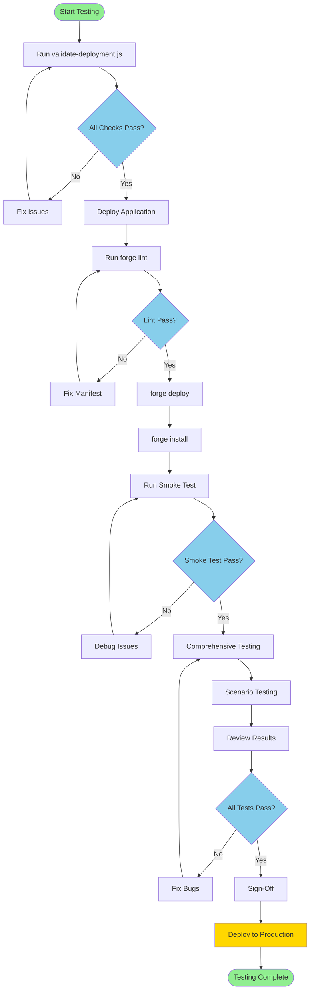

---

## Application Flow Diagram

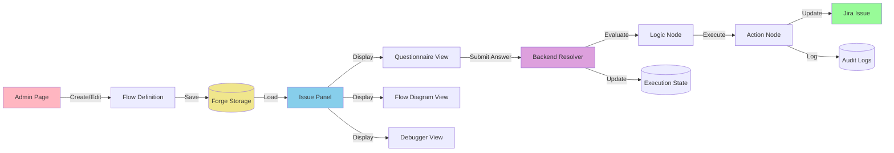

---

## Test Coverage Map

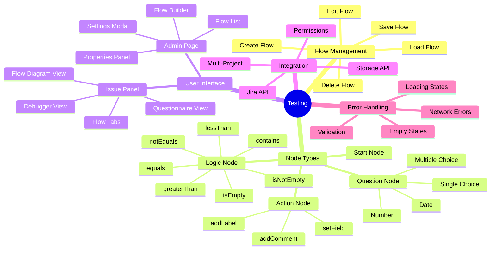

---

## Test Execution Flow

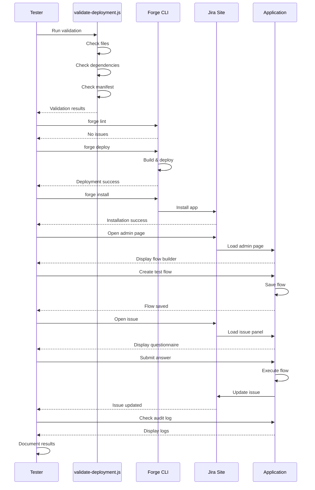

---

## Decision Flow Example

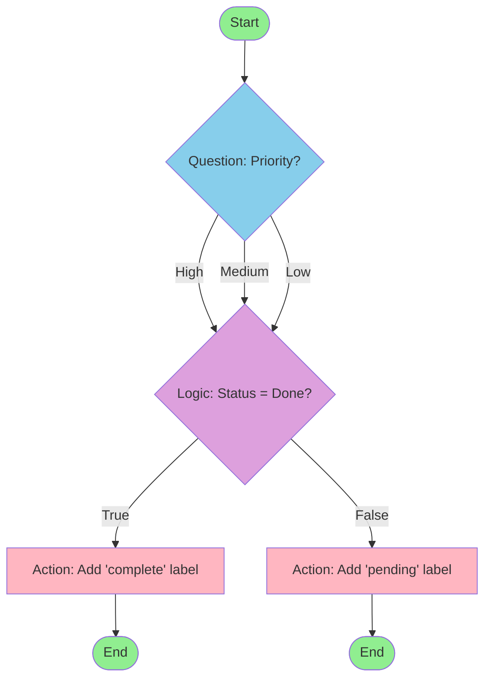

---

## Test Case Relationships

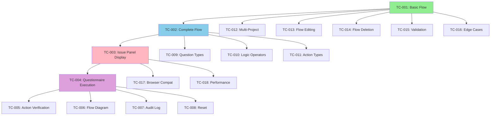

---

## Component Architecture

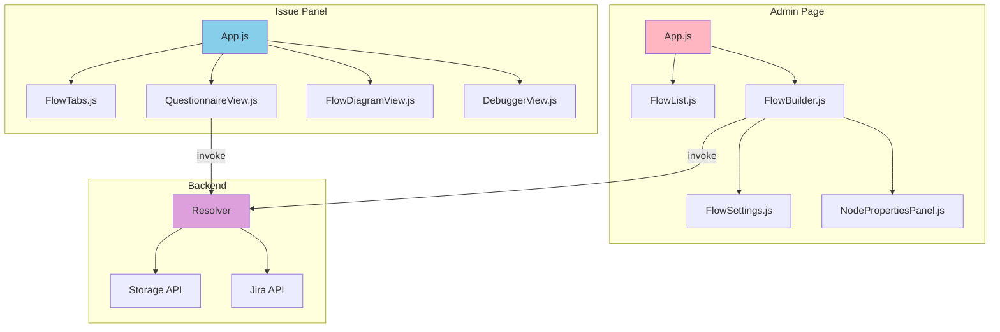

---

## Data Flow Diagram

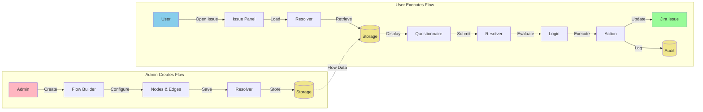

---

## Testing Phases Timeline

```mermaid
gantt
    title Testing Timeline
    dateFormat  HH:mm
    axisFormat %H:%M
    
    section Setup
    Run Validation Script    :done, setup1, 00:00, 2m
    Deploy Application       :done, setup2, 00:02, 5m
    Install on Jira         :done, setup3, 00:07, 3m
    
    section Smoke Test
    Access Admin Page       :active, smoke1, 00:10, 1m
    Create Simple Flow      :smoke2, 00:11, 2m
    Test in Issue Panel     :smoke3, 00:13, 2m
    
    section Comprehensive
    Flow Creation Tests     :comp1, 00:15, 15m
    Questionnaire Tests     :comp2, 00:30, 15m
    Visualization Tests     :comp3, 00:45, 10m
    Advanced Tests          :comp4, 00:55, 20m
    
    section Scenarios
    Test Scenarios          :scen1, 01:15, 30m
    
    section Review
    Document Results        :review1, 01:45, 15m
    Sign-Off               :review2, 02:00, 5m
```

---

## Test Priority Matrix

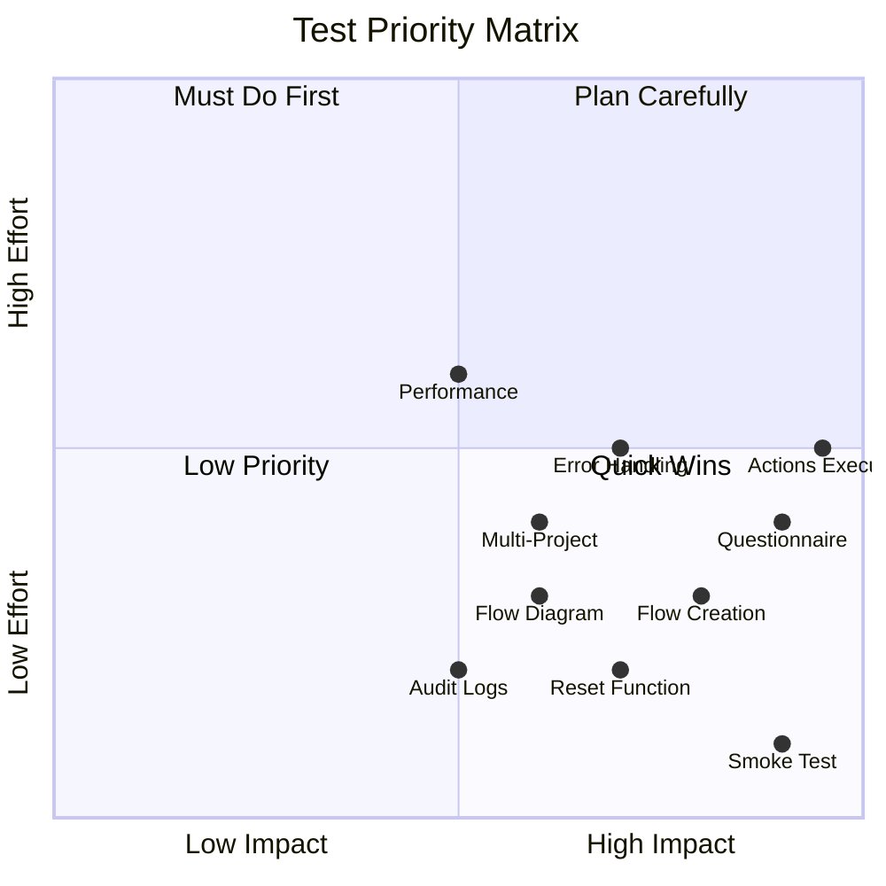

---

## Success Criteria Checklist

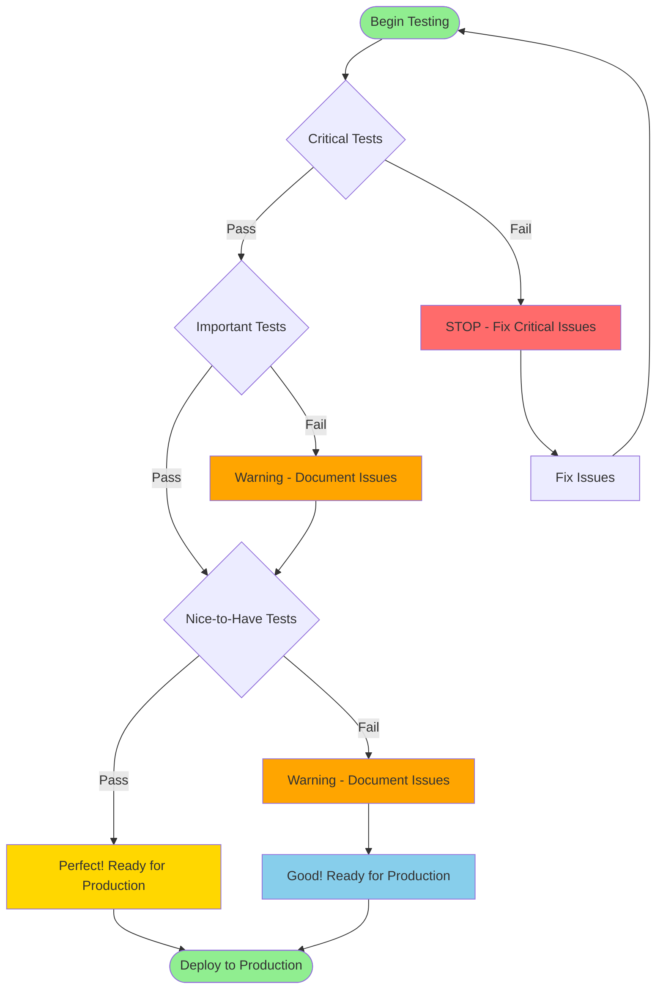

---

## Issue Severity Flow

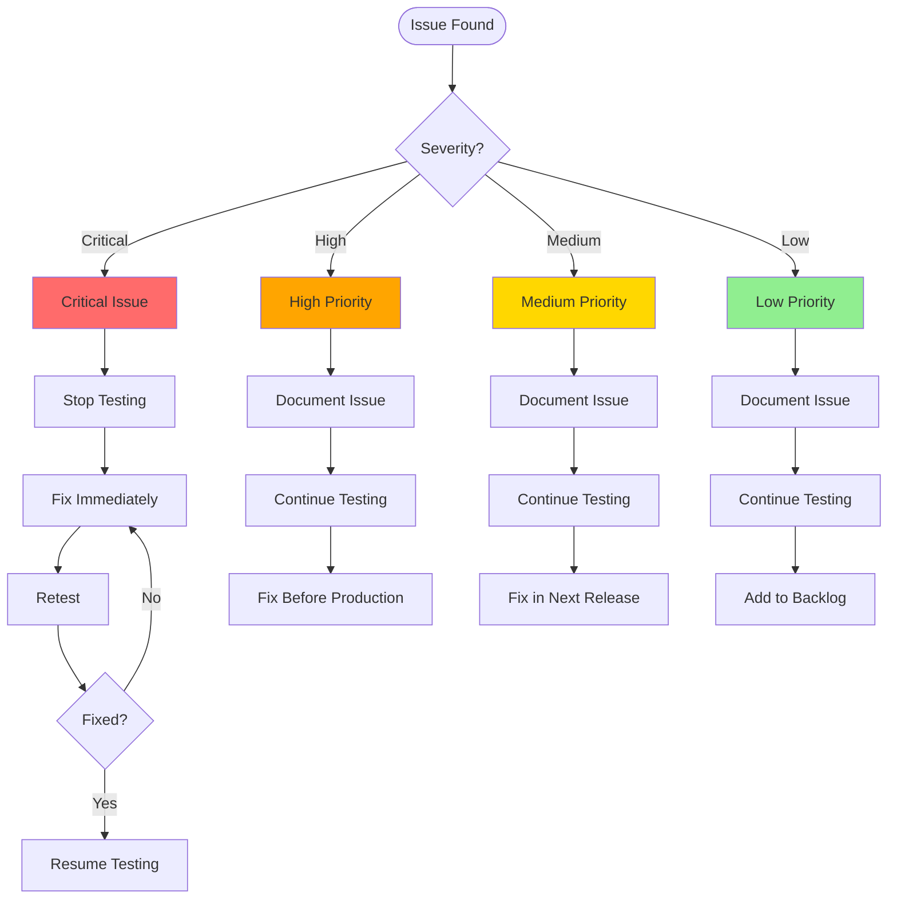

---

## Documentation Navigation Map

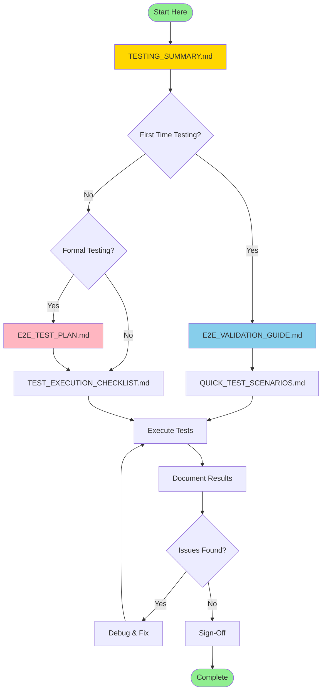

---

**Use these diagrams to understand the testing workflow and application architecture!**

